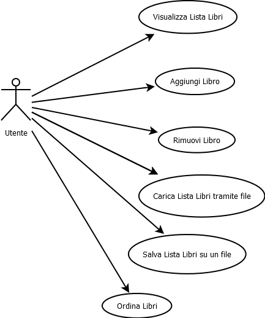

### User Requirements Specification Document

**VERSION : 2.0**

**Authors**  
Massimo Narizzano

**REVISION HISTORY**

| Version    | Date        | Authors      | Notes        |
| ----------- | ----------- | ----------- | ----------- |
| 1.0 | 27/06/2024 | Massimo Narizzano| Creazione Struttura |
# Table of Contents

1. [Introduction](#p1)
	1. [Document Scope](#sp1.1)
	2. [Definitios and Acronym](#sp1.2) 
	3. [References](#sp1.3)
2. [System Description](#p2)
	1. [Context and Motivation](#sp2.1)
	2. [Project Objectives](#sp2.2)
3. [Requirement](#p3)
 	1. [Stakeholders](#sp3.1)
 	2. [Functional Requirements](#sp3.2)
 	
  
  

## 1. Introduction

### 1.1 Document Scope

### 1.2 Definitios and Acronym

| Acronym				| Definition | 
| ------------------------------------- | ----------- | 
| ISBN                                  | International Standard Book Number|

### 1.3 References 

1. ISBN : https://www.isbn.it/

## 2. System Description

### 2.1 Context and Motivation

Si PRogetti un software per la gestione privata dei libri. 
### 2.2 Project Obectives 

Il sistema dovrà permettere ad un utente di memorizzare informazioni su dei libri (titolo autore anno e ISBN). Deve inoltre permettere di recuperare informazioni su un libro e aggiungere togliere libri dalla libreria.

## 3. Requirements

| Priorità | Significato | 
| --------------- | ----------- | 
| M | **Mandatory:**   |
| D | **Desiderable:** |
| O | **Optional:**    |
| E | **future Enhancement:** |

### 3.1 Stakeholders

Utente Generico : ha come obiettivo quello di memorizzare tutti i libri che vuole in un unico posto

### 3.2 Functional Requirements 
Di seguito possiamo vedere una descrizione delle principali funzionalità

#### 3.2.1 Aggiungi Libro
<b>Nome</b> Aggiungi Libro

<b>Precondizioni</b> 

<b>Priorità</b> Mandatory

<b>Stakeholder Principale</b> Utente

<b>Scenario Principale</b> 

	1. Il Sistema chiede di inserire un nuovo titolo
	2. Utente inserisce un titolo
	3. Il Sistema chiede di inserire un autore
	4. Utente inserisce un autore
	5. Il Sistema chiede di inserire l'anno di pubblicazione
	6. Utente inserisce un anno
	7. Il Sistema chiede di inserire l'ISBN
	8. Utente inserisce ISBN 
 	9. Il sistema valida il nuovo libro correttamente
   	10. Il sistema inserisce il nuovo libro in libreria
    	11. Il sistema saluta

<b>Scenario Alternativo</b> 
	2A - L'utente inserisce un titolo non valido
 	
  	1. Il sistema Notifica titolo non valido
   	2. Il sistestema torna al punto 1 dello scenario principale

<b>Scenario Alternativo</b>
9A. - Esiste già un libro con lo stesso ISBN

 	1. Il sistema notifica l'utente 
  	2. Il Sistema mostra il libro con lo stesso ISBN
	3. Il Sistema chiede se vuole sostituire il vecchio libro
 	4. Utente dice si
  	5. Il sistema cancella vecchio libro
   	6. Il sistema Inserisce il nuovo libro

<b>Scenario Alternativo</b>
9A.4a - Utente dice no

	1. Sistema chiede se vuole modificare l'ISBN
 	2. Utente dice si
  	3. Il sistema torna al punto 8 dello scenario principale

<b>Scenario Alternativo</b>   
9A.4a.2a  - Utente dice no

	1. Il sistema notifica che rimane tutto così 
 	2. Il sistema torna torna al punto 11 dello scenario principale
  

    

<b>Post-Condizioni</b>

La cifra richiesta viene prelevata dal conto corrente aggiornando il saldo

#### 3.2.2 Deposito 

<b>Nome</b>

<b>Precondizioni</b>

<b>Priorità</b>

<b>Stakeholder Principale</b>

<b>Scenario Principale</b>

<b>Scenario Alternativo</b>

<b>Scenario Alternativo</b>

<b>Post-Condizioni</b>

#### 3.2.3 Trasferimento

<b>Nome</b>

<b>Precondizioni</b>

<b>Priorità</b>

<b>Stakeholder Principale</b>

<b>Scenario Principale</b>

<b>Scenario Alternativo</b>

<b>Scenario Alternativo</b>

<b>Post-Condizioni</b>

#### 3.2.4 Saldo
<b>Nome</b>

<b>Precondizioni</b>

<b>Priorità</b>

<b>Stakeholder Principale</b>

<b>Scenario Principale</b>

<b>Scenario Alternativo</b>

<b>Scenario Alternativo</b>

<b>Post-Condizioni</b>

#### 3.2.5 Accensione

<b>Nome</b>

<b>Precondizioni</b>

<b>Priorità</b>

<b>Stakeholder Principale</b>

<b>Scenario Principale</b>

<b>Scenario Alternativo</b>

<b>Scenario Alternativo</b>

<b>Post-Condizioni</b>

#### 3.2.6 Spegnimento

<b>Nome</b>

<b>Precondizioni</b>

<b>Priorità</b>

<b>Stakeholder Principale</b>

<b>Scenario Principale</b>

<b>Scenario Alternativo</b>

<b>Scenario Alternativo</b>

<b>Post-Condizioni</b>

